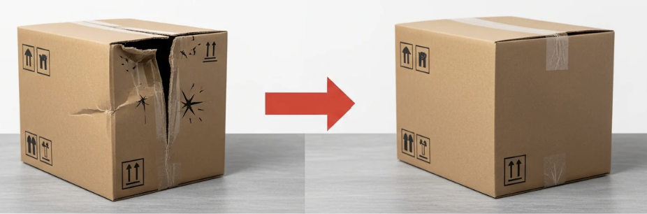

# 📦 Damaged Box Detection using YOLOv11

A damaged package detection system built with **YOLOv11**. This project detects the condition of boxes/packages (damaged/normal) in real-time via webcam, from images, or from video files.



## ✨ Features

- 🎥 **Camera mode** — real-time detection using a webcam
- 🖼️ **Image mode** — detection on a single image or an entire folder of images
- 🎬 **Video mode** — detection on a video file, with results saved automatically
- 📊 FPS & resource (CPU/RAM) monitoring during inference
- 💾 Detection results are automatically saved to the `outputs/` folder

## 🚀 Installation
Clone the repository

```bash
git clone https://github.com/moktaviani/Damaged-Box-Detection-using-YOLOv11.git

cd Damaged-Box-Detection-using-YOLOv11
```

Install dependencies

```bash
pip install -r requirements.txt
```

## ▶️ Usage

### Camera Mode (real-time)

python main.py --mode camera --weights best.pt

### Image Mode (single file / folder)

python main.py --mode image --weights best.pt --source photo.jpg
python main.py --mode image --weights best.pt --source my_photos_folder

### Video Mode

python main.py --mode video --weights best.pt --source test.mp4 

### Additional Arguments

| Argument | Default | Description |
|---|---|---|
| `--conf` | 0.25 | Confidence threshold (lower = more sensitive) |
| `--iou` | 0.45 | NMS IoU threshold |
| `--imgsz` | 640 | Inference resolution |
| `--device` | auto | `cpu`, `0` (first GPU), etc. |
| `--no-show` | - | Run without opening the display window |
| `--no-save` | - | Don't save results to disk |

## 🧠 Model & Dataset

- **Model**: YOLOv11, fine-tuned specifically for box condition detection (damaged/normal). Full training details and the notebook are available in a separate repository: [Damaged-Packages-Detection-using-YOLOv11](https://github.com/moktaviani/Damaged-Packages-Detection-using-YOLOv11)
- **Dataset**: [Damaged Box Detection Dataset — Roboflow Universe](https://universe.roboflow.com/bdata-497-advanced-topics-in-data-visualization/final-project-zseyl/dataset/2)
